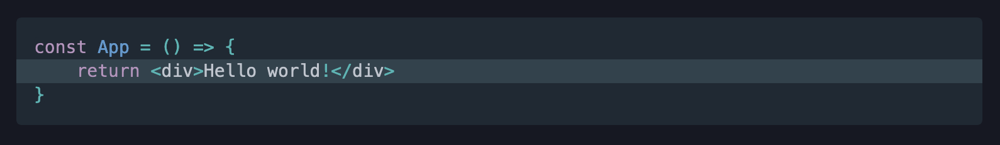
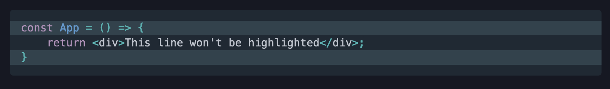

Code blocks are a great way to explain concepts to your readers, and you'll want to make them as easy to understand as possible. In this post I'll be covering some of the ways you can improve the code blocks on your Gatsby blog.
## Use syntax highlighting with gatsby-remark-prismjs
Syntax highlighting changes the colour of parts of your code to make it more readable. It’s something you’re used to having in your code editor, but you can have it in your code blocks too!

Syntax highlighting is available with the [gatsby-remark-prismjs](https://www.gatsbyjs.com/plugins/gatsby-remark-prismjs/) plugin. You may already have it installed if you started your blog using one of Gatsby’s default templates.

To use syntax highlighting, you’ll need to specify the language of your code block: 
````
```javascript
const App = () => {
    // This is a comment!
    return 'I am returning a string';
}
```
````
And you will get beautiful syntax highlighting like so:

You can see the full list of supported languages over on the [PrismJS](https://prismjs.com/#supported-languages) website.

## Add a copy button with gatsby-remark-code-buttons
To save your readers having to manually copy code, you can provide them with a “copy code” button using [gatsby-remark-code-buttons](https://www.gatsbyjs.com/plugins/gatsby-remark-code-buttons/).
This will work great for anyone who is using Markdown to power their Gatsby blog. 

_Unfortunately_ for MDX users there isn’t a plugin available so you will have to hack your own solution. My blog is powered with MDX, so I may have to look into how to do this in the future.

## Focus on specific lines of code with line highlighting
Sometimes you'll want the reader to focus on a specific line of code, but still show the code around it. You can create this focus by using line highlighting.

This doesn’t need another plugin, as [gatsby-remark-prismjs](https://www.gatsbyjs.com/plugins/gatsby-remark-prismjs/#line-highlighting) provides this out of the box. 

If you want to highlight a specific line, you can add a `// highlight-line` comment to the end of it:
````
```
const App = () => {
    return <div>Hello world!</div> // highlight-line
}
```
````

If you have more lines you want to highlight, you can also specify the specific line numbers you want highlighted:
````
```javascript{1,3}
const App = () => {
	return <div>This line won't be highlighted</div>;
}
```
````

## Show a diff to see added/removed lines
As an alternative to line highlighting, you can also show code diffs using plus and minus signs.
````
```diff
const App = () => {
-	return <div>This line was removed</div>;
+	return <div>This line was added</div>;
}
```
````
With some CSS, you’ll be able to make the “+” line green, and the “-“ line red. The one downside here is that you will lose any language-specific syntax highlighting. 

I personally haven't needed to use this one yet, but I could see it being useful in some scenarios.

## Add code headings with gatsby-remark-code-titles
Sometimes you’ll want to show code blocks from different files. In this scenario, it’s helpful to your reader if you show the title of the current file. [gatsby-remark-code-titles](https://www.gatsbyjs.com/plugins/gatsby-remark-code-titles/) is a plugin that will handle this for you.

You can specify the title on the first line of your code block like this:
````
```js:title=example-file.js
alert('how cool is this!');
```
````
This will render the title above your code block. You can then add some custom CSS to it, and you can end up with something like this:


---

With its massive ecosystem of plugins, Gatsby makes it simple to add these improvements to your code blocks. 

Thanks for reading!


