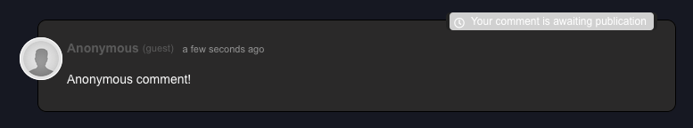

import Gif from 'components/gif';

Does your Gatsby blog have a commenting system set up? If not, you could be missing out! Comments help drive engagement by giving your readers an avenue to ask you questions and add useful information to your blog posts.

Gatsby doesn’t provide comments out of the box, but I’ll be showing you how easy it is to get started with two separate commenting systems - [utterances](https://utteranc.es/) and [GraphComment](https://graphcomment.com/en/).

## Add comments to your Gatsby blog with utterances
### How does utterances work?
[utterances](https://utteranc.es/) is a commenting system built on top of Github. Users will have to authenticate with their Github account before they can leave a comment on your site:


This will create a new issue in a Github repo of your choice, and the comment will appear there.


If another comment is left on the same page, a comment will be added to that same Github issue. 

This integration with Github makes utterances a good choice if you're running a blog that is mainly read by other developers (since they will most likely have Github accounts).

### Setting up utterances
You can follow the set-up steps from the [utterances documentation](https://utteranc.es/). Namely: 
1. Make a new public repository on Github for your comments.
2. Go to the [utterances Github app](https://github.com/apps/utterances), and install it on that repository.

### Add a comments component to your Gatsby blog
You’ll be given a script to add to your site that looks like this:

```js
<script src="https://utteranc.es/client.js"
     repo="[emgoto/emgoto-comments]"
     issue-term="pathname"
     theme="github-light"
     crossorigin="anonymous"
     async>
</script>
```

Since we’re using React, we won’t be able to just plop this script in. Instead, make a React component called `Comments`:

```jsx:title=src/components/comments.js
import React, { useEffect } from 'react';

const COMMENTS_ID = 'comments-container';

const Comments = () => {
    useEffect(() => {
        const script = document.createElement('script');
        script.src = 'https://utteranc.es/client.js';
        script.setAttribute('repo', 'emgoto/emgoto-comments'); // highlight-line
        script.setAttribute('issue-term', 'pathname');
        script.setAttribute('theme', 'dark-blue');
        script.setAttribute('crossorigin', 'anonymous');
        script.async = true;

        const comments = document.getElementById(COMMENTS_ID);
        if (comments) comments.appendChild(script);

        // This function will get called when the component unmounts
        // To make sure we don't end up with multiple instances of the comments component
        return () => {
            const comments = document.getElementById(COMMENTS_ID);
            if (comments) comments.innerHTML = '';
        };
    }, []);

    return (
        <div id={COMMENTS_ID} />
    );
};

export default Comments;
```

You can just copy-paste the code above, but make sure to change the `repo` line (highlighted above) to your own comments repository.

After that, you can drop your new component into wherever you render your blog posts. I have a template file that is rendered on each blog post page, so I put mine at the bottom of that file:

```jsx:title=src/templates/blog-post.js
const BlogPost = () => (
    <>
        // Code to render blog post content
        <Comments />
    </>
);
```

And you're done! 🎉 If you're reading this post on [my website](https://emgoto.com/gatsby-comments/), you can scroll down to the bottom to view this component in action.

### Theming and styling utterances 
utterances provides 7 different colour schemes, including both dark mode and light mode options. You can try out all the options for yourself on the [documentation page](https://utteranc.es/).

<Gif src="/gatsby-comments/themes.gif" height="466px" alt="GIF rotating through all the different utterances color schemes"/>

Since utterances renders in a iframe, you can’t add your own CSS to modify the colour schemes. So you’ll have to choose one of the available options. If you _really_ want to stick to your blog’s colour scheme, you could also try raising a PR to add a new theme.

The iframe will be wrapped a div with the `.utterances` class name, so it is possible to make some positioning modifications there. utterances has some built-in margins and padding on their comments component, so if you wanted to remove that, you can do something like this:

```css
.utterances {
    margin: -16px 0;
    padding: 0 -4px;
}
```

## Add comments to Gatsby with GraphComment

[GraphComment](https://graphcomment.com/en/) works similarly to other comment systems like Disqus. They host the comments for you, and allow users to create an account with a username and avatar on their platform. They provide a free tier for up to 1 million data loads a month.


Anonymous users also have the ability to leave comments. In your GraphComment settings, you can choose whether these anonymous comments are immediately published, or to hold off until you approve them first.




### Setting up GraphComment

After [signing up](https://graphcomment.com/admin/#/register) for a GraphComment account, you'll need to add your site on the [admin page](https://graphcomment.com/admin/#/welcome).

GraphComment will then give you a script like this:

```js
<div id="graphcomment"></div>
<script type="text/javascript">
  window.gc_params = {
    graphcomment_id: 'emgoto',
    fixed_header_height: 0,
  };
  
  (function() {
    var gc = document.createElement('script'); gc.type = 'text/javascript'; gc.async = true;
    gc.src = 'https://graphcomment.com/js/integration.js?' + Date.now());
    (document.getElementsByTagName('head')[0] || document.getElementsByTagName('body')[0]).appendChild(gc);
  })();
</script>
```

Since we’re using React, we’ll need to convert this into a React component:

```js
import React, { useEffect } from 'react';

const COMMENTS_ID = 'graphcomment';

const Comments = () => {
    useEffect(() => {
        window.gc_params = {
            graphcomment_id: 'emgoto', // highlight-line
            fixed_header_height: 0,
          };

        const script = document.createElement('script');
        script.src = 'https://graphcomment.com/js/integration.js?' + Date.now();
        script.async = true;

        const comments = document.getElementById(COMMENTS_ID);
        if (comments) comments.appendChild(script);

        // This function will get called when the component unmounts
        // To make sure we don't end up with multiple instances of the comments component
        return () => {
            const comments = document.getElementById(COMMENTS_ID);
            if (comments) comments.innerHTML = '';
        };
    }, []);

    return <div id={COMMENTS_ID} />
};

export default Comments;
```

Make sure to change `graphcomment_id` (the highlighted bit) to the ID you used when you added your site.

Then you can drop in this new `<Comments />` component wherever you want to render it.

### Theming and styling GraphComment
In my opinion the UI for GraphComment isn’t as nice as utterances (which re-uses Github UI) but considering it’s a free service, I can’t complain too much!

GraphComment is smart enough to detect whether your site is in light mode or dark mode and render accordingly. You can also choose a theme colour:


All this really does is choose the accent colour that renders on the page (in the below screenshot, it's blue).


Beyond this, there are no customisation options available.

## Add a unit test for your comments component

After you've set up utterances or GraphComment, make sure to add a unit test to make sure that the script is rendering on the page:

```js:title=src/components/comments.test.js
import React from 'react';
import { render } from '@testing-library/react';

import Comments from './index';

describe('Comments component', () => {
    test('should render comments script', () => {
        const { container } = render(<Comments />);
        const script = container.querySelector(
            // choose one of the following lines below
            // 'script[src="https://utteranc.es/client.js"]',
            // 'script[src^="https://graphcomment.com/js/integration.js"]',
        );
        expect(script).toBeTruthy();
    });
});
```

## Utterances vs Disqus (and other competitors)
Disqus is the most well-known commenting system and is used across many sites. However it has had some controversies in the past with [affiliate links and injecting advertising code](https://en.wikipedia.org/wiki/Disqus#Criticism,_privacy,_and_security_concerns). For that reason, I decided to give Disqus a miss and see what other solutions were out there. 

utterances lets readers leave comments using a Github account, so it’s a great solution if you run a developer-targeted blog. For other types of blogs, GraphComment is the only option I found that provides a free tier (excluding Disqus).

If you don’t mind paying, it may be worth taking a look at other options like [Commento](https://commento.io/) or [FastComments](https://fastcomments.com/). Unfortunately there doesn't seem to be anything on the market that lets you heavily customise the design to suit your needs. The closest may be [Hyvor](https://talk.hyvor.com/docs/appearance) which does provide a wide variety of appearance settings. Their system starts at $5 a month for 100k monthly pageviews.

## Conclusion

Setting up comments on your Gatsby blog is a hassle-free experience with both utterances and GraphComment. utterances is a great option for developer blogs, while GraphComment does provide more features (like auto-moderation and keyword filtering) however this does come at the cost of a slightly less slick UI.

The biggest downside with both options is that you are limited to the provided colour schemes and design, and so the comments component may look slightly “off” compared to the rest of your site. 

