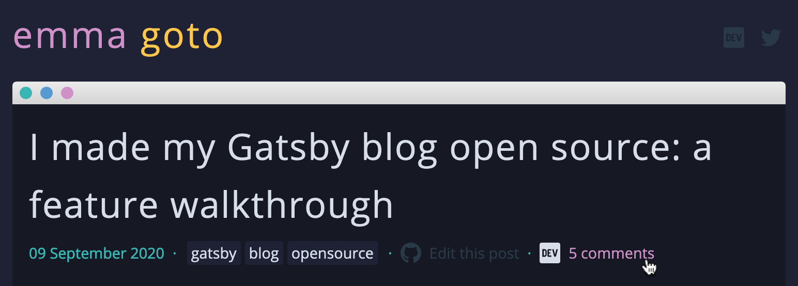

Currently my personal blog site doesn’t support comments. Since I cross-post all of my posts to DEV, I got the idea to show how many comments my blog post has received on DEV:



My blog is open-source, so you can check out the code over on [Github](https://github.com/emgoto/emgoto.com/blob/master/src/components/content/comments/index.js).

## Using DEV.to’s API
DEV provides an [articles API](https://docs.dev.to/api/#tag/articles) that lets you get data about any article that has been published on DEV. Each article will look something like this:

```json
  {
    "type_of": "article",
    "id": 451782,
    "title": "I made my Gatsby blog open source: a feature walkthrough",
    "description": "I recently open-sourced my blog built using Gatsby! This post will walk you through why I chose Gatsb...",
    "readable_publish_date": "Sep  9",
    "slug": "i-made-my-gatsby-blog-open-source-a-feature-walkthrough-49oe",
    "path": "/emma/i-made-my-gatsby-blog-open-source-a-feature-walkthrough-49oe",
    "url": "https://dev.to/emma/i-made-my-gatsby-blog-open-source-a-feature-walkthrough-49oe",
    "comments_count": 5,
    "public_reactions_count": 74,
    "collection_id": null,
    "published_timestamp": "2020-09-09T20:57:58Z",
    "positive_reactions_count": 74,
    // ... the list goes on!
}
```

The two values that I'm interested in from this API are the `comments_count` and `url` values.

## Storing the article ID in my frontmatter

Each of my posts are written in Markdown, with a bunch of metadata known as the **frontmatter** at the top. The frontmatter for this post looks like this:

```
---
title: "Using the DEV API to add DEV.to comment counts to my blog"
date: 2020-09-17
tags: ["blog", "dev"]
category: "blog"
emoji: 💬
devArticleId: 12345
---
```

I'm storing the article ID in the frontmatter, so that when this post is rendered, I can call DEV's API with that ID.

## Finding your DEV article’s ID

I needed to add this `devArticleId` value to all of my Markdown posts. I ended up doing this manually by grabbing a list of my articles on DEV using this endpoint:

```html
https://dev.to/api/articles?username=emma
```

And then cross-referencing the DEV articles with my blog post.

Alternatively, if I wanted to grab the ID for a specific article I can also find that by inspecting the article's source code on DEV and looking for `data-article-id`:

```html
<div 
    class="crayons-article__body text-styles spec__body"
    data-article-id="422738"
    id="article-body"
>
```
## Creating a data-fetching hook
Since my blog runs on Gatsby, I can create a React hook to fetch my data:
```js
const useDevArticleComments = devArticleId => {
    const [loading, setLoading] = useState(!!devArticleId);
    const [data, setData] = useState();

    useEffect(() => {
        devArticleId &&
            fetch(`https://dev.to/api/articles/${devArticleId}`)
                .then(response => response.json())
                .then(response => {
                    setData(response);
                    setLoading(false);
                })
                .catch(error => setLoading(false));
    }, [devArticleId]);

    return {
        loading,
        data: data && {
            comments: data.comments_count,
            url: data.url,
        },
    };
};
```

I’m returning two values here - `loading` and `data`. While `loading` is true, I don’t render anything and wait for the data to load. Once the data comes in, I can display either the number of comments on my post, or a prompt to leave a comment.

After creating this component, I also took the time to install Jest and [add some unit tests](https://github.com/emgoto/emgoto.com/blob/master/src/components/content/comments/test.js). Unit tests are definitely something I tend to neglect in my side projects, so I want to make a conscious effort to properly unit-test this blog!