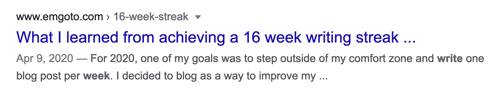

When you share your Gatsby blog to the world, you’ll want to make sure you give a good first impression. With [react-helmet](https://github.com/nfl/react-helmet) and meta tags, we can make sure your posts show up in Google like this:

And on Twitter like this:

## What are meta tags?
Meta tags live in the header of every web page:
```html
<html>
    <head>
        <title>Emma Goto</title> //highlight-line
    </head>
</html>
```
This is what Google, Twitter and other sites use when they are rendering previews of your website. 

It’s important to get your meta tags right, because you want users to click the link! They’re more likely to do this if what they see intrigues them, whether it’s from a fancy image or a relevant description.
## Install the React Helmet plugin for Gatsby
To get started with meta tags on your Gatsby blog, you’ll need to install [gatsby-plugin-react-helmet](https://www.gatsbyjs.com/plugins/gatsby-plugin-react-helmet/).
If you created your blog using a template like [gatsby-starter-blog](https://www.gatsbyjs.com/starters/gatsbyjs/gatsby-starter-blog), you’ll probably already have this plugin installed. 
If not, you can install it:
```bash
yarn add gatsby-plugin-react-helmet
// or
npm install gatsby-plugin-react-helmet
```
And then make sure to add it to your list of plugins:
```js:title=gatsby-config.js
const config = {
    plugins: [
        // ... all your other plugins
        'gatsby-plugin-react-helmet', //highlight-line
    ]
}
```
## Create a component using React Helmet
After installing the plugin, you can create your React Helmet component:
```jsx:title=src/components/seo/index.js
import React from 'react';
import Helmet from 'react-helmet';

const SEO = () => (
    <Helmet
        htmlAttributes={{
            lang: 'en',
        }}
    />
);
```
Make sure render this component on every page of your blog!

## Pass in props and use the useStaticQuery hook
Before we get started with the meta tags, you’ll also want to make sure that you  pass in any relevant data as props, like post titles and slugs:

```jsx
const SEO = ({ description, title, slug }) => {
```
You can also make use of the `useStaticQuery` hook to grab your site's metadata:
```jsx:title=src/components/seo/index.js
import { useStaticQuery, graphql } from 'gatsby';

const SEO = ({ description, title, slug }) => {
    const { site } = useStaticQuery(
        graphql`
            query {
                site {
                    siteMetadata {
                        title
                        description
                        author
                        siteUrl
                    }
                }
            }
        `,
    );
```

This will grab any site metadata that has been stored in your config file:
```js:title=gatsby-config.js
const config = {
  siteMetadata: {
    title: `Emma Goto`,
    description: `Front-end development and side projects.`,
    author: `Emma Goto`,
    siteUrl: `https://www.emgoto.com`,
  },
  // ...
}
```

## Adding your page’s title
Now we can get started with the most important piece of information - your page’s title. This is what shows up as the title of your post on Google, as well as what you see as the title of the page in your browser.
```jsx
<Helmet
    title={title}
    titleTemplate={`%s · ${site.siteMetadata.title}`}
    defaultTitle={site.siteMetadata.title}
/>
```
There are three separate title props we can pass in here. The logic is as follows:
* If the `title` value exists, it will be used in combination with the `titleTemplate` value
* Otherwise, it will fall back to showing the `defaultTitle` value

Using my blog as an example, if I’m on a blog post’s page I pass in its `title` as a prop. My title looks like this:
```
Name of the blog post · Emma Goto
```
If I’m on the home page, the `title` value will be undefined, and instead the `defaultTitle` is be used:
```
Emma Goto
```

## Adding your page’s description
After your title, the second-most important thing would be your description. This is what can show up underneath the title in a Google search result.

Similar to the title, I either have a description specific to my post (passed in as a prop), or else I show my default description:
```jsx
<Helmet
    //...
    meta={[
        {
            name: 'description',
            content: description || site.siteMetadata.description,
        },
    ]}
/>
```

### Getting a post’s description
If you want specific descriptions for your posts, you can manually write them and store it on your post’s front matter. 

If you have a huge backlog of posts without custom descriptions, or you don’t want to write them yourself, each post’s first 140 characters are stored in an `excerpt` value:
```graphql
query($slug: String!) {
    markdownRemark(frontmatter: { slug: { eq: $slug } }) {
      excerpt // highlight-line
      frontmatter {
        slug
        title
      }
    }
}
```

## Adding Open Graph meta tags
To add social media-specific meta tags, we can use [Open Graph](https://ogp.me/) meta tags. These meta tags were originally created and used by Facebook, but are now also used by other social media sites like Twitter.
```js
{
    property: `og:title`,
    content: title || site.siteMetadata.title,
},
{
    property: 'og:description',
    content: description || site.siteMetadata.description,
},
{
    property: `og:type`,
    content: `website`,
},
```
If you don’t use these, social media sites may fall back to your default title and description values. But I would include them just to be on the safe side.
> You’ll notice that we are using `property` instead of `name` for the meta tag name here. This is something you’ll need to do specifically when using Open Graph meta tags.

## Adding Twitter-specific meta tags
By default, Twitter will make use of the Open Graph meta tags. But if you wanted to have specific meta tags only for Twitter, Twitter also provides [their own meta tags](https://developer.twitter.com/en/docs/twitter-for-websites/cards/guides/getting-started) which will override the Open Graph ones:
```js
{
    name: 'twitter:title',
    content: title || site.siteMetadata.title,
},
```

### Should I add the twitter:creator and twitter:site meta tags?
You may have come across `twitter:site` and `twitter:creator`:
```js
{
    name: `twitter:creator`,
    content: '@emma_goto',
},
{
    name: `twitter:site`,
    content: '@emma_goto',
},
```
In the past, Twitter link previews would contain your Twitter handle, but as far as I can tell, these values are no longer used. 
The meta tags are still mentioned in their documentation though, so if you still want to include them it doesn’t hurt to do so.

## Adding images to your link previews
To add an image when you share your blog’s link on Twitter, you’ll need Open Graph’s image meta tag:
```js
{
    property: 'og:image',
    content: 'image-url-here',
},
```
Twitter can render your link preview image in two ways. Either with a **240x240** square image:

Or a larger **800x418** image, like you saw at the top of this post.

When choosing an image, you’ll also have to let Twitter know which size you are using. For the large image you’ll need to include this:
```js
{
    name: 'twitter:card',
    content: 'summary_large_image',
},
```
And for the small, square image, you’ll need to add this:
```js
{
    name: 'twitter:card',
    content: 'summary',
},
```
## Pro-tip: Cover images on DEV
If you are cross-posting your Gatsby posts to [DEV](https://dev.to), you’ll be able to provide a **1000x420** cover image to be used on DEV.

This same image will be used if your DEV post is shared on Twitter - and since Twitter images have a width of **800px** the edges of your DEV cover image will be cut off. You’ll want to make sure that your DEV cover images have a sufficient amount of padding on either side, so that nothing important is cut off.

For reference, this is the cover image that I use on DEV:


## Adding your favicon
To get an icon to show up next to your website's name, you’ll need to include a favicon value:
```jsx
import favicon from '../../images/favicon.png';

<Helmet
    link={[
        {
            rel: 'shortcut icon',
            type: 'image/png',
            href: `${favicon}`,
         },
    ]}
/>
```
My favicon is a **192x192** PNG image, which seems to do the trick.

## How do I get dates to show up on Google search results?
You may have noticed that when you search on Google, some posts will show a published date. This isn’t something you can explicitly control or set a meta tag for. As long as you clearly render a date on your posts, Google should be able to pick it up, and will decide whether it's worth showing or not.
## Tools to test your link previews
If you want to test how your site would look if it was shared on social media, Twitter and Facebook both provide their own preview tools to do so:
* [Twitter card validator](https://cards-dev.twitter.com/validator)
* [Facebook sharing debugger](https://developers.facebook.com/tools/debug/)

## Conclusion
This post should give you everything you need to know to add meta tags to your Gatsby blog. To see the full code for my site’s SEO component, you can head over to [Github](https://github.com/emgoto/emgoto.com/blob/master/src/components/seo/index.js).

If you’re adding any logic to your SEO component (like different sets of meta tags on different pages) I would also recommend adding some unit tests! You can check out [the unit tests for my SEO component](https://github.com/emgoto/emgoto.com/blob/master/src/components/seo/test.js) for some inspiration.

Thanks for reading!