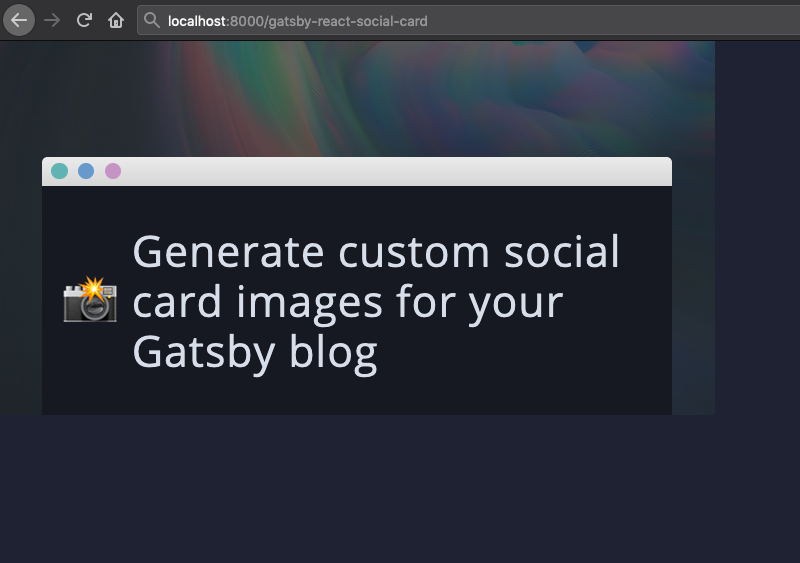
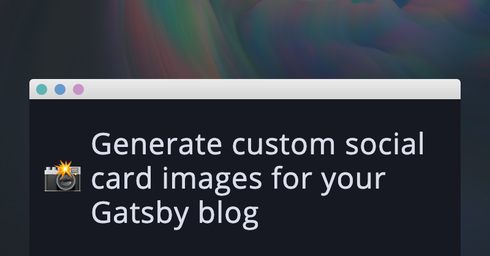
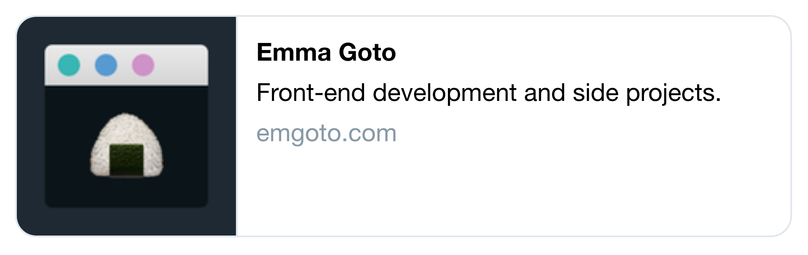

One of the ways you can make your Gatsby posts stand out to readers is to add a social card image. In this post, you'll learn how to generate these images automatically with [gatsby-plugin-react-social-cards](https://www.gatsbyjs.com/plugins/gatsby-plugin-react-social-cards).

## What is a social card?

A social card is the preview shown when you paste a link into a site like Twitter:


This can give readers more context on your post, and entice them to click the link. 

There are a couple of existing [Gatsby](https://www.gatsbyjs.com/plugins/gatsby-plugin-social-cards/) [plugins](https://www.gatsbyjs.com/plugins/gatsby-remark-social-cards/) which let you create social card images from a template. However their customisation options are quite limited. Up until now I've been using a modified version of [Maxence Poutord's script](https://www.maxpou.fr/generate-social-image-share-with-gatsby), which lets you take a screenshot of a React component.

I decided to turn this script into a proper Gatsby plugin, [gatsby-plugin-react-social-cards](https://www.gatsbyjs.com/plugins/gatsby-plugin-react-social-cards).

## How does gatsby-plugin-react-social-cards work?

Before diving into the set-up, here's a quick summary of how the plugin works. 

When you run `gatsby develop`, the plugin will create new pages for each of your social card images. The page will render your custom React component:



You can pass in all the relevant information from your post's frontmatter (like title and description) into the component as props, and render them however you want.

The plugin then uses [Puppeteer](https://developers.google.com/web/tools/puppeteer) to take a screenshot of that component, and save it to your images folder:



Simple!
 
## Get started with gatsby-plugin-react-social-cards
First, install the Gatsby plugin:

```bash
npm install gatsby-plugin-react-social-cards
# or
yarn add gatsby-plugin-react-social-cards
```

As with all Gatsby plugins, you’ll need to declare it in your `gatsby-config.js` file:

```js:title=gatsby-config.js
{
    plugins: [
        {
            resolve: `gatsby-plugin-react-social-cards`,
            options: {
                query: // TODO
                queryToPages: // TODO
                component: require.resolve('./src/components/social-card.js'),
                cardLimit: 0, // for debugging purposes
            },
        },
    ]
}
`
```

I’ll be walking you through each of the option values below.

## Creating your GraphQL query
The first option, `query`, is the GraphQL query you’ll use to fetch all the pages you want social cards for. 

Your Gatsby blog probably fetches a list of pages to render on your site’s home page. You can copy-paste this query to get started.

It should look something like this:

```js
query: `
    {
        allMarkdownRemark {
            nodes {
                fields {
                    slug
                }
                frontmatter {
                    title
                    description
                }
            }
        }
    }
`
```

The query should contain:
* The slug for the page
* Any data that you want to use in your social card (such as a page's title or description)

## Create your queryToPages function
You will then need to transform the data into a shape that the plugin can use. One of your options will be a `queryToPages` function. It should look something like this:

```js:title=gatsby-config.js
(result) =>
    result.data.allMarkdownRemark.nodes.map(node => {
        const slugWithoutSlashes = node.fields.slug.node.slug.replace(/\//g, '');
        return {
            slug: `/${slugWithoutSlashes}`,
            pageContext: {
                title: node.frontmatter.title,
                description: node.frontmatter.description,
            },
        };
})
```

As you loop through all the nodes in your query, each object should contain a `slug` and a `pageContext` object:

```js
{
    slug: '/my-page-name',
    pageContext: {
        // You can put anything you want in the context!
        title: 'My page title',
        description: 'My page description'
    }
}
```

The `pageContext` object will be passed through as a prop to your React component, so make sure you include everything that you want here.

## Create your social card React component

Now we can create our React component. I've created the file in my `components` folder.  If you're putting it somewhere else, make sure you change the location in your plugin options.

```js:title=src/components/social-card.js
import React from 'react';

const SocialCard = ({ pageContext: { title, description, height, width } }) => {
    return <div>{title}</div>
}

export default SocialCard;
```

By default, the screenshot taken will be with dimensions 1200px by 628px, which is the [recommended image size for Twitter](https://sproutsocial.com/insights/social-media-image-sizes-guide/#twitter). `height` and `width` will be passed in as props, so feel free to use this to set the size of your React component as well.

For now you can keep your component simple - I'll be explaining how to test it below.

## Test your social card React component
After completing the above steps, you can start up your Gatsby blog:
```bash
gatsby develop
```

You will be able to view the pages for your social cards at a URL like `localhost:8000/<your-post-slug>-social-card`.

> 💡 **Can't find the page you're looking for?**
> 
> Try visiting your Gatsby site's 404 page by making up a broken URL e.g. `localhost:8000/blahblah`. This will show you a list of all your site's pages. You may be able to spot the social card pages here.

Since this React component is going to be screenshotted at 1200x628, make sure that it renders as you would expect at this height and width. You could add some CSS like `border: 1px solid red` around your component to double-check.

Once you’re happy with the React component, you’re ready to screenshot!

## Changing the cardLimit value
The final option in our plugin settings was the `cardLimit` value. This is included to let you debug your component without any screenshots being taken. Initially its value was `0`, but you can change it to `1` so that it will take one screenshot. This screenshot will be saved in your `static` folder.

After changing your `gatsby-config.js` file, your browser will prompt you to restart your server. I recommend instead **killing and starting your Gatsby server**. I’ve found that when restarting, it will take the screenshot while your site is still loading.

If you're not happy with a screenshot, delete the image from the `static` folder. The next time you start up your server, the screenshot will be taken again.

When you’re happy with the screenshot, you can delete the `cardLimit` option altogether. Now it will take screenshots for all your pages.

## Add your image to your SEO component
Now that we have our social card images, we can add its URL to your site’s SEO component. 

> If you want to know more about SEO and meta tags, I have a separate post on all you need to know about [meta tags with Gatsby](https://www.emgoto.com/gatsby-metatags/).

I’m assuming that you already have a SEO component set up, so the following code shows the minimum you need to add social card images to your site:

```js:title=src/components/seo.js
import React from 'react';
import Helmet from 'react-helmet';

const SEO = ({ slug, isPost }) => {
	const siteUrl = 'https://www.emgoto.com';
    const slugWithoutSlashes = () => slug.replace(/\//g, '');

    const socialCard = isPost
        ? `${siteUrl}/${slugWithoutSlashes()}-social-card.png`
        : `${siteUrl}/square-social-card.png`;

    const twitterCard = isPost ? 'summary_large_image' : 'summary';

    return (
        <Helmet
            meta={[
               {
                    name: 'twitter:card',
                    content: twitterCard,
                },
                {
                    property: 'og:image',
                    content: socialCard,
                },
			}],
		/>
	);
}
```

I'm passing in a `isPost` prop to my SEO component. Since I only generate social card images for my posts, this lets me fall back to a default image for all other pages on my site.

I use this square image as my fallback:
  


The `twitterCard` value tells Twitter whether the image is a small square image (`summary`) or a large cover image (`summary_large_image`).

## Changing the screenshot size 
Different social media sites use different image sizes. If you wanted to use a different set of dimensions, you can pass it in as a plugin option:

```js:title=gatsby-config.js
options: {
    dimensions: [{
	    width: 1200,
	    height: 628,
	    suffix: '-social-card'
	}]
}
```

The `suffix` value determines the image name e.g. `your-slug-social-card.png`.

Since `dimensions` is an array, you can also pass in more than one item, and create multiple images of varying dimensions per post.

## Other options
You can further customise the plugin with a couple of other settings:

* **imageFolder** - defaults to `'static'`. Change if you want to save your images to another folder
* **baseUrl** - defaults to `'http://localhost:8000'`. Change if you start your dev server on another port.
* **timeout** - defaults to `5000`. These are the milliseconds waited before the screenshot is taken. Increase this number if you need to wait for images to load, or decrease if you’re finding it to be too slow.

## Conclusion

This was my first ever Gatsby plugin, so I would love to hear your feedback if you gave this plugin a go!

Please feel free to leave a comment below, or raise an issue on the [gatsby-plugin-react-social-cards](https://github.com/emgoto/gatsby-plugin-react-social-cards) repository.
