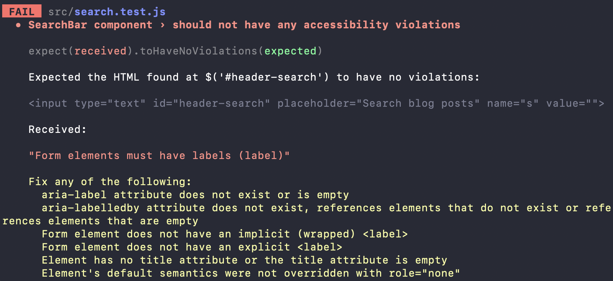

import Gif from 'components/gif';

A search bar is a great way to make content on your website discoverable. In this tutorial, we’ll be building an accessible search bar component using React. We’ll also be adding a couple of unit tests for the component with React Testing Library.

The final product we’ll be building will look like this:

<Gif src="/react-search-bar/example.gif"/>

If you want to follow along with the code, the full source code is available over at [react-search-bar](https://github.com/emgoto/react-search-bar).

## Render your search bar component in the app
To get started, created a new file for your search component. I've called mine `search.js`:
```jsx:title=src/search.js
const Search = () => {
    return <div>Hello world!</div>
}

export default Search;
```

Then, render this component from inside of your main app file:

```jsx:title=src/App.js
import Search from './search'; // highlight-line

const App = () => {
    return (
        <Search /> // highlight-line
    );
}

export default App;
```

> **Where did `import React from 'react'` go?**  
> You may notice that we no longer have an import statement at the top of every file. From the release of React 17, this is [no longer necessary](https://reactjs.org/blog/2020/09/22/introducing-the-new-jsx-transform.html). (Yay!) If you happen to be on an older version, you may still need this import statement.

## Add your HTML elements
Our search bar component will contain a couple of HTML elements. Add a label, input and button, and then wrap it all in a form element:
```jsx:title=src/search.js
const SearchBar = () => (
    <form action="/" method="get">
        <label htmlFor="header-search">
            <span className="visually-hidden">Search blog posts</span>
        </label>
        <input
            type="text"
            id="header-search"
            placeholder="Search blog posts"
            name="s" 
        />
        <button type="submit">Search</button>
    </form>
);

export default SearchBar;
```

This will render like this:


### Accessibility and labels
You might be wondering why we are doubling up on the label and placeholder text. 

This is because placeholders [aren’t accessible](https://www.w3.org/WAI/tutorials/forms/instructions/#placeholder-text). By adding a label, we can tell screen reader users what the input field is for.

We can hide our label from users who can view the placeholder text with a [visually-hidden](https://www.a11yproject.com/posts/2013-01-11-how-to-hide-content/) CSS class:
```css:title=src/App.css 
.visually-hidden {
    clip: rect(0 0 0 0);
    clip-path: inset(50%);
    height: 1px;
    overflow: hidden;
    position: absolute;
    white-space: nowrap;
    width: 1px;
}
```
This keeps it visible to screen reader users, but invisible to everyone else.

Now we have a functioning search bar! When you search, you will navigate to `/?s=<your_query_here>`.

<Gif src="/react-search-bar/navigation.gif"/>

## Add a list of posts
Now that we can search, we’ll need a list of items to search from. I've created a list of fake posts:

```js
const posts = [
    { id: '1', name: 'This first post is about React' },
    { id: '2', name: 'This next post is about Preact' },
    { id: '3', name: 'We have yet another React post!' },
    { id: '4', name: 'This is the fourth and final post' },
];
```

Then use the `map` function to loop through and render them:

```jsx:title=src/App.js
const App = () => {
    return (
        <div>
            <Search />
            <ul>
                {posts.map((post) => ( //highlight-line
                    <li key={post.id}>{post.name}</li>
                ))}
            </ul>
        </div>
    );
}
```

## Filter the list based on your search query
Our search bar will navigate us to a new URL when we perform a search. So we'll need to grab this value from the URL:

```js
const { search } = window.location;
const query = new URLSearchParams(search).get('s');
```

We’ll also need a function that filters out posts depending on the search query. If the list you’re querying over is simple, you can write your own:
```js
const filterPosts = (posts, query) => {
    if (!query) {
        return posts;
    }

    return posts.filter((post) => {
        const postName = post.name.toLowerCase();
        return postName.includes(query);
    });
};
```

You can also rely on third-party search libraries (like [js-search](https://github.com/bvaughn/js-search)) to filter posts for you.

Using your search query and filter function, you can render only the posts that match your search:

```jsx:title=src/App.js
const App = () => {
    const { search } = window.location;
    const query = new URLSearchParams(search).get('s');
    const filteredPosts = filterPosts(posts, query); // highlight-line

    return (
        <div>
            <Search />
            <ul>
                {filteredPosts.map(post => ( // highlight-line
                    <li key={post.key}>{post.name}</li>
                ))}
            </ul>
        </div>
    );
}
```

Now when you type in a query, you will be a able to filter your posts!

## Adding immediate search or “search as you type”
Instead of pressing enter to submit your search, you may also want the list to filter as the user begins typing. This immediate response can be more pleasant from a user-experience perspective.

To enable this, you can store a `query` value in your component’s state, and change this value as the user begins typing:
```jsx:title=src/App.js

import { useState } from 'react'; // highlight-line

function App() {
    const { search } = window.location;
    const query = new URLSearchParams(search).get('s');
    const [searchQuery, setSearchQuery] = useState(query || ''); // highlight-line
    const filteredPosts = filterPosts(posts, searchQuery); // highlight-line

    return (
        <div>
            { /* highlight-range{2,3} */ }
            <Search
                searchQuery={searchQuery}
                setSearchQuery={setSearchQuery}
            />
            <ul>
                {filteredPosts.map(post => (
                    <li key={post.key}>{post.name}</li>
                ))}
            </ul>
        </div>
    );
}
```
After you pass in the `searchQuery` and `setSearchQuery` props, you’ll need to make use of it in your input element:
```jsx:title=src/search.js
const SearchBar = ({ searchQuery, setSearchQuery }) => ( //highlight-line
    <form action="/" method="get">
        <label htmlFor="header-search">
            <span className="visually-hidden">Search blog posts</span>
        </label>
        { /* highlight-range{2,3} */ }
        <input
            value={searchQuery}
            onInput={e => setSearchQuery(e.target.value)}
            type="text"
            id="header-search"
            placeholder="Search blog posts"
            name="s"
        />
        <button type="submit">Search</button>
    </form>
);
```
Now, as soon as you start typing, your posts will begin filtering!

<Gif src="/react-search-bar/example.gif"/>

### “Search as you type” and accessibility
In writing this post, I did try to find out if it was possible to have an accessible "search as you type" experience. However, I wasn't really able to find any clear answers on this

To make sure your component is accessible, the best approach to take would be to cater for both use cases. Allow for filtering as users type, but also trigger a page navigation when users hit enter.

(Page navigation also comes with the added benefit of users being able to link to search queries!)

## Testing your component with React Testing Library
To wrap things up, we’ll be testing our component using React Testing Library.

The first test we’ll be adding is an accessibility check using `axe`. To use it, add the `jest-axe` package to your repository:
```bash
yarn add jest-axe
```
We can use axe to test that our search component does not have any accessibility violations:
```jsx:title=src/search.test.js
import { render } from '@testing-library/react';
import { axe, toHaveNoViolations } from 'jest-axe';
import Search from '../src/search';

expect.extend(toHaveNoViolations);

test('should not have any accessibility violations', async () => {
    const { container } = render(<Search searchQuery='' />);
    const results = await axe(container);
    expect(results).toHaveNoViolations();
});

```
This is a super simple way to catch simple accessibility issues. For instance, if we removed our label component, our test will fail:


> Axe can’t pick up on all accessibility violations, so still make sure to manually test your component too.

We should also add a test that tests the functionality of your component. Let’s add one that tests when you type “preact”, that it only shows one post:
```jsx:title=src/App.test.js

test('should render one post when user searches for preact', () => {
    render(<App />);

    let posts = screen.getAllByRole('listitem');
    expect(posts.length).toEqual(4);

    const searchBar = screen.getByRole('textbox');
    userEvent.type(searchBar, 'preact');

    posts = screen.getAllByRole('listitem');
    expect(posts.length).toEqual(1);
});

```
## Conclusion
After reading this post, you will be able to create an accessible search bar component for your React app. With unit tests!

If you're interested in viewing the full source code, I have made it available at [react-search-bar](https://github.com/emgoto/react-search-bar).
