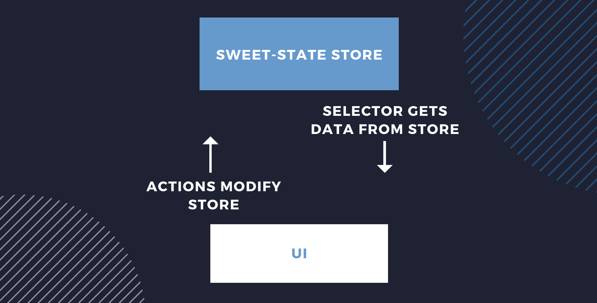

---
title: "React state management with sweet-state"
date: 2020-07-03
updated: 2020-11-20
tags: ["react"]
emoji: 🍭
coverImage: 'https://images.unsplash.com/photo-1563262924-641a8b3d397f?ixlib=rb-1.2.1&ixid=eyJhcHBfaWQiOjEyMDd9&auto=format&fit=crop&w=1950&q=80'
devArticleId: 380451
--- 

Looking for a simpler state management solution for React? This post will walk you through how to get set up with [react-sweet-state](https://github.com/atlassian/react-sweet-state).

> Check out the [react-sweet-state example](https://github.com/emgoto/react-state-comparison/tree/master/src/react-sweet-state). It's a to-do list app I'll be referring to throughout this post.

## Why use sweet-state?

sweet-state was created to meet the state management needs of Jira, a project-tracking software. I’d recommend checking out Alberto’s post on the [creation of react-sweet-state](https://medium.com/@albertogasparin/react-sweet-state-redux-and-context-the-yummy-parts-f55f49503635) for more of its backstory.

One of its benefits is that **you don’t need to wrap your app in a provider**. This works well for a codebase like Jira’s, which consists of many small apps with their own state. When you need to share state between two apps, it’s easier when you don’t need to wrap your entire codebase in a provider.

## Redux vs sweet-state

You might be wondering how sweet-state stacks up against [Redux](https://redux.js.org/), the most widely-used state management library.

The two main differences between Redux and sweet-state are:

1. sweet-state need you to wrap the app in a provider, and Redux does.
2. Redux has separate actions and reducers. sweet-state merges these two together.

## Getting up to speed: stores, actions and selectors
There are a couple of state management concepts that we will be referring to in this post:

* A **store** is a central location where we put all the state for our app.
* An **action** is in charge of modifying the store. We dispatch these actions from the UI.
* A **selector** returns a specific chunk of our store to the UI.



## Installing react-sweet-state
Use your package manager of choice to install sweet-state:
```bash
npm i react-sweet-state
# or 
yarn add react-sweet-state
```

## Creating your sweet-state store

The example app we will be using is a to-do list app. The shape of its **store** will look like this:

```js
const initialState = {
  listName: 'My new list', // <- the name of our to-do list
  tasks: {} // <- all our to-do list items live inside this object
};
```

To create a store, we will need to call `createStore`. 

```js:title=state/store/index.js
import { createStore } from 'react-sweet-state';

export const Store = createStore({
    initialState,
    actions: {},
    name: 'TasksStore'
});
```

> Fun fact: we can use [Redux Devtools](https://chrome.google.com/webstore/detail/redux-devtools/lmhkpmbekcpmknklioeibfkpmmfibljd?hl=en) when debugging sweet-state!
> The name we choose for our store is used to identify it in there.

## Creating a selector in sweet-state
Since we store all our data in our sweet-state store, we also need **selectors** to get that data out of the store for our UI to use.

For example, if we wanted to get our to-do list's name:

```jsx:title=state/selectors/index.js
export const nameSelector = (state) => state.listName;
```

After we've created our selector, we can turn it into a hook with `createHook`:

```jsx:title=state/store/index.js
import { createStore, createHook } from 'react-sweet-state'; // highlight-line

export const Store = createStore({
    initialState,
    actions: {},
    name: 'TasksStore'
});

// highlight-range{1-3} 
export const useName = createHook(Store, {
    selector: nameSelector
});
```

Now in our UI, we can use that hook to grab the name value from our store:

```jsx:title=components/name/index.js
import { useName } from '../../state/store'; // highlight-line

const Name = () => {
    const [listName] = useName(); // highlight-line
    return <NameView name={listName} />;
};

export default Name;
```

## Creating an action in sweet-state
When a user modifies the name of the to-do list, we will dispatch an **action** to modify the name value in our store.

Here's the action:

```js:title=state/actions/list-name/index.js
const updateListName = (listName) => ({ setState }) => {
    setState({ listName });
}
```

### Understanding setState
You’ll notice that the action is a **function that returns another function**.

However, when we call this action from our UI, we will only need to call the outer function:

```js
updateListName('New name');
```

Behind the scenes, sweet-state will handle providing the `setState` parameter.

You may have also noticed that our store contains both `tasks` and `listName`, but we only passed in `listName`:

```js
setState({ listName })
```

This is because when you call `setState`, it will do a shallow merge with what is currently in your store, like this:

```js
{ ...state, listName }
```

(This is the same as how React's `setState` function works).

### Using getState
As well as `setState`, sweet-state also provides a `getState` function. 

If we needed to modify a specific task in our to-do list, we can use `getState` to first grab all the tasks. Then we can find the one that we want to modify:
```js:title=state/actions/tasks/index.js
const updateTaskName = (id, name) => ({ getState, setState }) => {
    const { tasks } = getState(); // highlight-line
    const updatedTask = { ...tasks[id], name };
    setState({ tasks: { ...tasks, [id]: updatedTask } });
};
```

When setting state, you have to make sure to **never directly modify the state object that you receive**. This means we can’t do this:
```js
const { tasks } = getState();
tasks[id].name = name
```

We want our app to re-render when values in our store change, but if we directly edit the state object this won’t happen.

> If you're dealing with complex state objects, you can also check out libraries like [immer](https://github.com/immerjs/immer) to make life easier.

### Adding actions to your store

After you've defined these actions, make sure you go back to your store and add them:

```js:title=state/store/index.js
import { createStore } from 'react-sweet-state';

export const Store = createStore({
    initialState,
    // highlight-range{1-4} 
    actions: {
        updateListName,
        ...taskActions
    },
    name: 'TasksStore'
});
```

### Accessing actions using hooks
Like our selector, we'll want to access our actions via hooks. 
Any selector hooks we create already provide you with all your actions, so you don't need to do anything.

We can use it by accessing the **second item** returned in our hook's array.

```js
const [listName, { updateListName }] = useName();

updateListName('new name');
```

## Creating a hook without a selector
You may have a scenario where your component only needs to access some actions, and doesn’t need any data. In this case, you can pass in a `null` selector to `createHook`:
```js
export const useTaskActions = createHook(Store, {
    selector: null
});
```

When you make use of this new hook, make sure to ignore the first element in the array (as it will be null):
```js
const [, { updateTaskName, deleteTask }] = useTaskActions();
```

## Create multiple stores using containers
In our current example, we have one store that contains our to-do list. But what if we had two to-do lists, and wanted two stores?

In this scenario, we can make use of containers to scope our data:

```jsx
import { createContainer } from 'react-sweet-state';

export const TodoListContainer = createContainer(Store);
```

And then wrap it around each to-do list:

```jsx
<TodoListContainer scope={id}>
    { /** To-do list code here */ }
</TodoListContainer>
```

By passing in a `scope` prop, any actions or selectors used inside of that container will be scoped to the container.

## Passing in props into a container
You can also use containers to pass in props that then become available in your actions.

If your to-do list has some user preferences:
```jsx
<TodoListContainer userPreferences={userPreferences} />
```

You can then access this data from your actions:

```jsx
const updateTaskName = (id, name) => (
    { getState, setState },
    { userPreferences } // highlight-line 
) => {
   // ...
};
```

## Conclusion
With a store, selectors, and actions, you'll be all set up to do state management with sweet-state!

For more advanced use-cases, I encourage you to check out the [sweet-state docs](https://atlassian.github.io/react-sweet-state/#/).
