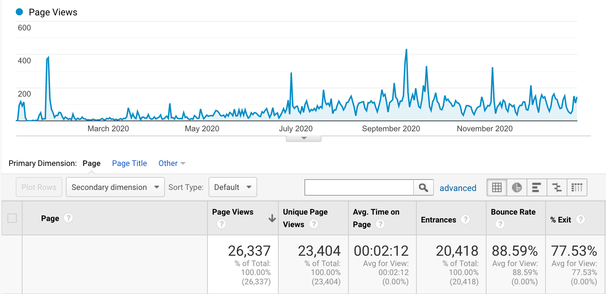
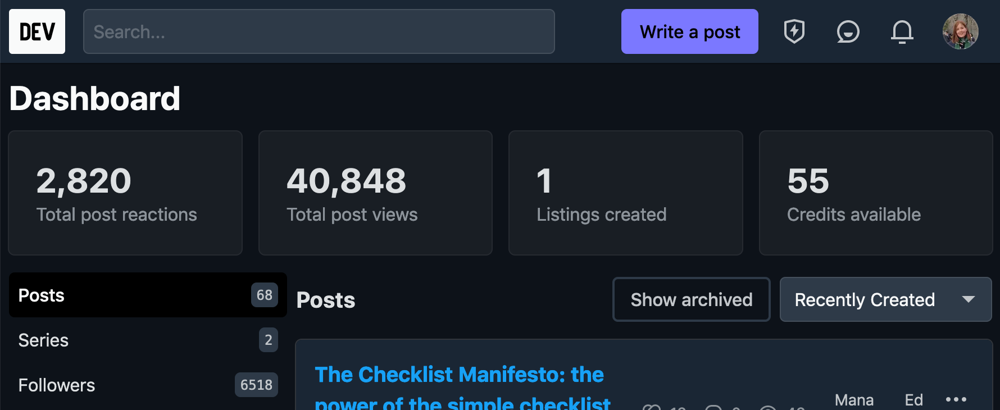
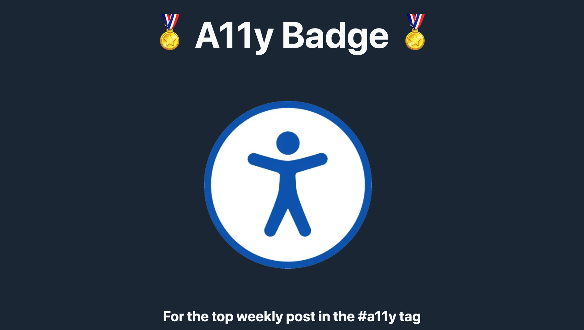
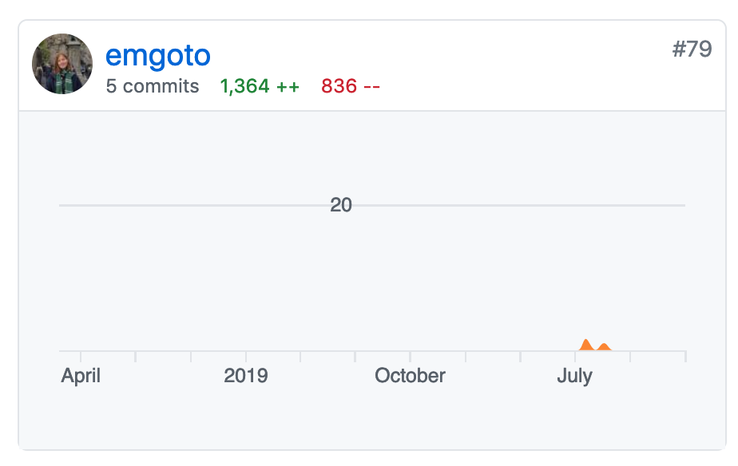

2020 was probably a really strange year for a lot of us. For me, I can definitely see the silver linings - I'm an introvert, and so I've loved being able to work from home, as well as spend more time with my elderly dog.

2020 was also the first year that I set out to _properly_ blog, and so I thought it was worthwhile to do a review post of how my year went.

## A year of writing: some statistics
### My most popular posts on emgoto.com
I published **53 posts** on my website in 2020, and received **26337** page views (according to Google Analytics):

Ignoring the spikes, you can start to see the volume increasing a bit in the second half of the year, as my posts start to show up in Google search results.

My top three posts were the following:

* [Jest code coverage report explained](https://www.emgoto.com/jest-code-coverage/)
* [Storing values with the useRef hook](https://www.emgoto.com/storing-values-with-useref/)
* [Analyze your React app’s bundle size and reduce it using code-splitting ](https://www.emgoto.com/react-bundles-and-code-splitting/)

These aren't particularly exciting topics but they’re all things that people Google for and want to know the answers to. They were also all written in the first third of the year. Since posts take a while to start showing up in Google search, I’m hoping that some of the posts I wrote later in the year will start to gain a bit of traction in 2021 too.

### My most popular posts on DEV
After publishing a post on [emgoto.com](emgoto.com/), I will usually also cross-post it to DEV. Initially no one really saw my posts, but as I gained a following this became more of an effective strategy (and something I highly recommend).

I started 2020 on DEV with 6 posts, 60 reactions, 905 views, and 34 followers.

This is what my DEV.to dashboard looked like by the end of the year:

2820 reactions, 40848 views and 6518 followers!

I published a total of **62 posts** in 2020. This is slightly more than what I published to my own site, since it includes my hackathon submissions and some news/announcement posts.

> I will point out that the follower count is a bit of a false metric. DEV originally had a feature where newcomers to the site were [automatically followed](https://dev.to/ben/changelog-suggested-follows-on-onboarding-3ifb) to 50 other DEV accounts (unless they opted out). My follower count growth dramatically slowed down once DEV changed this feature to be opt-in.

My top three posts (by both views and reactions) were the following:

* [How to take smart notes (as a developer)](https://dev.to/emma/how-to-take-smart-notes-as-a-developer-3og7)
* [How to build a search bar in React](https://dev.to/emma/how-to-build-a-search-bar-in-react-1lcn)
* [My 5 key takeaways from reading the Pragmatic Programmer](https://dev.to/emma/my-5-key-takeaways-from-reading-the-pragmatic-programmer-1959)

It’s interesting to see that my top-performing posts on my website aren't the same as on DEV. Generally, posts that apply to a wide range of people do better on DEV, like book reviews, or posts on popular technologies like React.

None of my posts were _quite_ popular enough to become one of the [7 most popular posts of the week](https://dev.to/badge/top-7) but I did manage to get the badge for the most popular accessibility post of the week!

### Twitter, my newsletter, and everything else
I went from **36** followers on Twitter to **293**. I’m not too big of a Twitter user so I’m pleasantly surprised that I have been gaining a small amount of followers.

I added a newsletter sign-up link to my website back in September, and then proceeded to never actually write one. I’m still finding a bit daunting to write something that’s going to end up in people’s inboxes. Right now I have **19** subscribers.

I also dabbled in open source, and made 5 commits to [Forem](https://github.com/forem/forem):

## On writing consistently
Back in April, I published [what I learnt from a 16 week writing streak](https://www.emgoto.com/16-week-streak/). On top of that, I would also add two things:

* Even you think the post you wrote is terrible, publish it. And even if you cross-post it to DEV and it doesn’t do well, don’t worry! It may get picked up by the Google algorithm and you’ll start to see a small trickle of visitors over time (maybe even in 6+ months). Writing is a long-term game, and so you shouldn’t be discouraged if you don’t see immediate results.
* If you use Twitter and want to tweet about a post you recently wrote, make sure to tag related accounts. For example, I found that when I wrote posts about the features I added to my Gatsby blog, the Gatsby team would sometimes retweet my tweets if I tagged them. Obviously don’t go overboard and spam people, though.

## 3 things that went well

Outside of my consistency in writing blog posts, I had some other successes worth mentioning:

1. **Winning prizes in two hackathons.** I won a grand prize in the [Twilio x DEV hackathon](https://dev.to/devteam/announcing-the-twilio-hackathon-winners-1lp4) and a runner’s up prize in the [Grant for the Web x DEV hackathon](https://dev.to/devteam/announcing-the-grant-for-the-web-x-dev-hackathon-winners-1nl4).
2. **Reading lots!** In 2020 I read 78 books, which is probably the most I've ever read since I was a kid.
3. **Spending money on gym classes.** Joining a gym was the best decision I made in 2020. I didn’t really have the self-discipline to  work out at home, but with gym classes, I know that if I skip one I’ve wasted my money, and that was a really good motivator to push me to go. I can’t do a proper push-up yet, but I've definitely gotten stronger and I’m starting to see some muscle definition in my arms so I’m really happy.

## 2 things that didn’t go well

1. **Trying to do too many things.** At one point I was trying to juggle open source contributions, side projects and writing a new blog post every week, and it was very overwhelming. I’ve come to realise that I should be kinder to myself, and allow myself more free time instead of trying to do everything and anything. In 2021, I’m planning on just sticking with writing.
2. **Japanese study.** I find it very hard to consistently study Japanese. Textbooks are so boring! I’ve decided to take a different approach for 2021, and focus on reading fiction books in Japanese, and hopefully just learn the language through exposure.

## Goodbye 2020 and hello 2021!

Day-to-day, it doesn’t really _feel_ like I did much in 2020, but looking back, I am quite proud of how many posts I did manage to write. With the 60,000+ views I got across my site and DEV, I think it goes to show that consistency can pay off, and I'm keen to see where this consistency can take me into 2021.
